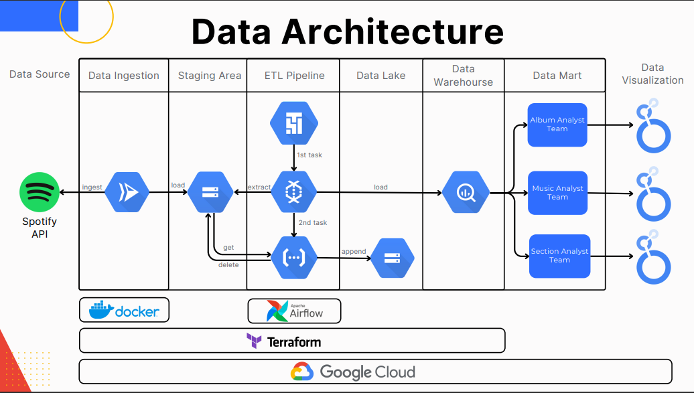

# Build Spotify Data Pipeline on GCP with Terraform

This repository contain my project about building spotify data pipeline on GCP with terraform.

## Architecture


## Run Locally

- Clone the project

    ```bash
    git clone https://github.com/ArkanNibrastama/spotify-data-pipeline
    ```
- Install all the dependencies
    ```bash
    pip install -r requirements.txt
    ```
- Fill the blank variable with your own data
    <br>example:
    ```bash
    variable "project_id" {
        default = "{YOUR PROJECT ID}"
    }
    ```
    ```python
    opt = PipelineOptions(
            save_main_session = True,
            runner = 'DataflowRunner',
            temp_location = "gs://arkan-spotify-analytics-resource/temp/",
            job_name = "arkan-spotify-analytics-etl-pipeline",
            project="{YOUR PROJECT ID}",
            template_location = "gs://arkan-spotify-analytics-resource/template/template.json"
        )
    ```
- Build the cloud infra

    ```bash
    terraform init
    ```
    ```bash
    terraform plan
    ```
    ```bash
    terraform apply
    ```


