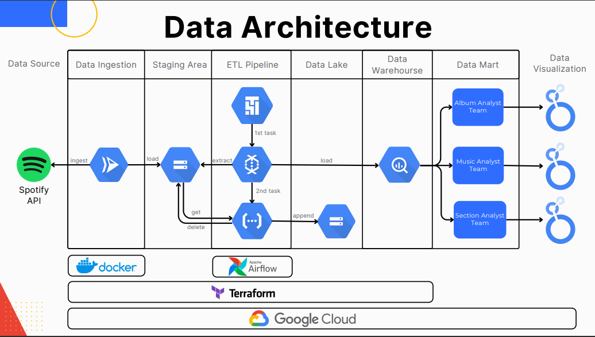

# Build Spotify Data Pipeline on GCP with Terraform

## Intro
In the fast-paced world of music streaming, platforms like Spotify need to process and analyze vast amounts of data to gain insights into user behavior, music trends, and album performance. However, managing and cleaning this data can be time-consuming, preventing data analysts from focusing on their core task of deriving insights. The "Spotify Data Pipeline" project was initiated to streamline and automate the data processing workflow, allowing data analysts to bypass the data cleaning stage and concentrate on analysis. By leveraging Google Cloud services and automation tools, this project ensures that data is efficiently processed, stored, and made accessible to various analyst teams, ultimately enhancing the speed and accuracy of data-driven decisions.

## Goals
The primary goals of the Spotify Data Pipeline project include:

1. <b>Automated Data Ingestion:</b> Develop a system to automatically fetch data from the Spotify API using Docker containers on Google Cloud Run, ensuring that data is consistently and reliably collected.

2. <b>Efficient Data Processing and Storage:</b> Use Google Dataflow and Apache Beam to transform raw data, store it in a Google Cloud Storage data lake, and organize it into a star schema data warehouse in BigQuery. This structure ensures that data is clean, well-organized, and ready for analysis.

3. <b>Data Accessibility and Scalability:</b> Cluster the processed data into data marts tailored for different analyst teams (e.g., album analysis, music trends) to enable easy access and scalability. This organization helps analysts quickly find relevant data without navigating through unnecessary details.

4. <b>End-to-End Pipeline Automation:</b> Orchestrate and schedule the entire ETL pipeline using Google Cloud Composer (Apache Airflow) to ensure that data is processed and updated regularly without manual intervention.

## Soiution


## How to Run 

- Clone the project

    ```bash
    git clone https://github.com/ArkanNibrastama/spotify-data-pipeline
    ```
- Install all the dependencies
    ```bash
    pip install -r requirements.txt
    ```
- Fill the blank variable with your own data
    <br>example:
    ```bash
    variable "project_id" {
        default = "{YOUR PROJECT ID}"
    }
    ```
    ```python
    opt = PipelineOptions(
            save_main_session = True,
            runner = 'DataflowRunner',
            temp_location = "gs://arkan-spotify-analytics-resource/temp/",
            job_name = "arkan-spotify-analytics-etl-pipeline",
            project="{YOUR PROJECT ID}",
            template_location = "gs://arkan-spotify-analytics-resource/template/template.json"
        )
    ```
- Build the cloud infra

    ```bash
    terraform init
    ```
    ```bash
    terraform plan
    ```
    ```bash
    terraform apply
    ```

## Conclusion
The implementation of the Spotify Data Pipeline has significantly optimized the data analysis process for Spotify's data analysts. <b>By automating data ingestion, processing, and storage, the project has freed up analysts to focus on extracting insights rather than cleaning data</b>. The organized data marts have streamlined access to relevant datasets, increasing the efficiency of analysis workflows. As a result, the project has enabled faster and more accurate data-driven decision-making, contributing to Spotify's ability to stay competitive in the dynamic music streaming industry.

## Full explanation
To make better understand of this repository, you can check my linkedin post about this project [Build Spotify Data Pipeline on GCP with Terraform](https://www.linkedin.com/feed/update/urn:li:activity:7081463138679738368/).


